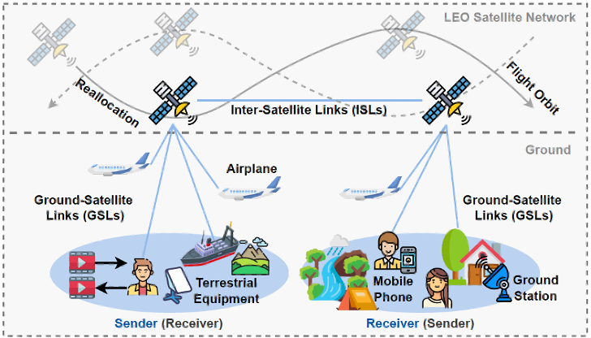

# 背景

&emsp;  低轨（LEO）卫星网络因其低时延、高覆盖的优势，正成为未来全球广域网络服务的重要补充。目前，SpaceX、OneWeb等公司已部署数千颗卫星，初步形成星座网络；我国星网工程也在加快推进，积极构建天地一体化信息网络。LEO卫星网络具备动态拓扑、链路多变、频繁切换等特点，使其网络服务面临带宽波动性大、链路预测难等挑战。因此，提升服务质量的关键之一在于精准的网络带宽预测。借助机器学习模型，可实现对历史网络状态的深度建模与未来网络带宽的有效预测，但如何实现高效且实时的预测，要求对机器学习的计算过程进行深度优化。

[LEO卫星动态拓扑](https://satellitemap.space/)、
[LEO卫星网络服务](https://www.bilibili.com/video/BV1nm42137eG)
<div style="display: flex; justify-content: space-around;">
  
  
</div>  
<br />

&emsp;  机器计算学习过程的核心计算单元是矩阵乘法运算。在实际应用中，如何高效利用加速硬件（如曙光DCU, 英伟达GPU等）和并行计算算法完成大规模矩阵乘，成为智能计算系统设计的关键问题。为应对高效准确LEO卫星带宽预测挑战，本次实训将围绕基于矩阵乘法的多层感知机（MLP）神经网络计算优化展开，通过设计一系列挑战任务，培训并引导参赛者从算法理解、性能建模、系统优化到异构调度完成一个完整的系统创新设计。

<strong>编程语言：</strong> C++， 曙光DCU ToolKit（DTK）；环境：曙光DCU实训平台；算力：8核CPU+1张DCU加速卡+16G内存

# 基础题：智能矩阵乘法优化挑战
已知两个矩阵：矩阵 A（大小 N × M），矩阵 B（大小 M × P）：

<strong>问题一：</strong> 请完成标准的矩阵乘算法，并支持浮点型输入，输出矩阵为 C = A × B，并对随机生成的的双进度浮点数矩阵输入，验证输出是否正确（N=1024，M=2048, P=512，N、M和P也可为任意的大数）；

<strong>问题二：</strong> 请采用至少一种方法加速以上矩阵运算算法，鼓励采用多种优化方法和混合优化方法；理论分析优化算法的性能提升，并可通过rocm-smi、hipprof、hipgdb等工具进行性能分析和检测，以及通过柱状图、折线图等图形化方式展示性能对比；

## 1. 基本优化思路

### 1.1 多线程并行化加速
&emsp;  通过多线程并行化加速计算过程，可充分利用多核CPU的计算资源，可采用OpenMP（Open Multi-Processing）实现矩阵乘法计算优化。

### 1.2 子块并行优化
&emsp;  子块并行（Block-wise Parallelization）是矩阵乘法中的一种优化技术，可通过局部计算降低内存访问延迟；为OpenMP或其他并行机制提供更细粒度、更均匀的工作划分，适用于大规模矩阵，特别适合在多核CPU上运行。

### 1.3 多进程并行优化
&emsp;  使用MPI（Message Passing Interface）实现矩阵乘法的多进程优化，其核心思想是将大矩阵按行或块划分给不同进程，利用进程间通信协同完成整个计算。适用于分布式系统或多节点多核并行平台，能突破单机内存和计算瓶颈。

### 1.4 DCU加速计算
&emsp;  通过国产高性能异构加速器、曙光DCU（Dawn Computing Unit），加速AI训练、推理和高性能计算场景。DCU与NVIDIA GPU特性类似，支持大规模并行计算，但通常通过HIP C++编程接口进行开发，兼容CUDA语义。

注：HIP（Heterogeneous-Compute Interface for Portability）是AMD公司在2016年提出的符合CUDA编程模型的、自由的、开源的C++编程接口和核函数语言。

### 1.4 其他计算优化方法或混合优化
&emsp;  除了以上并行机制，还有多种计算优化方法和混合优化策略，可进一步提升矩阵计算效率。如内存访问优化，混合并行优化等。

## 2. 基本编译环境介绍
1）g++编译和执行文件C++程序
```
g++ -o outputfile sourcefile.cpp
./outputfile
```

2）MPI和OpenMP两种并行编程模型来编译和执行C++程序
```
mpic++ -fopenmp -o outputfile sourcefile.cpp
./outputfile
```

3）曙光DCU编译和执行执行C++程序
```
hipcc source_dcu.cpp -o outputfile_dcu
./outputfile_dcu
```
注：也可以采用其他的编译执行方法

## 3. 示例代码框架获取
&emsp;  系统镜像基于Ubuntu，Ubuntu的基本常用命令均可使用。基本代码框架文件位于共享目录/public/SothisAI/learning_center/下：

- lesson1_sourcefile.cpp和lesson1_sourcefile_dcu.cpp 为实训课程1的代码框架
- lesson2_sourcefile_mlp_forward.cpp 为实训课程2的代码框架
- lesson3_sourcefile_mlp.cpp 为实训课程3的代码框架

查看和修改文件：
```
cp /public/SothisAI/learning_center/lesson1_sourcefile.cpp ./ //拷贝共享目录中的代码文件到当前目录
cp /public/SothisAI/learning_center/lesson1_sourcefile_dcu.cpp ./ //拷贝共享目录中的代码文件到当前目录
ls //显示当前目录下的文件
vim lesson1_sourcefile.cpp //用vim打开代码文件并进行修改
```

注：也可以采用其他工具修改代码文件内容