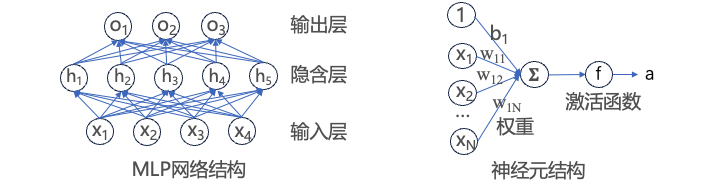

# 进阶题1：基于矩阵乘法的多层感知机实现和性能优化挑战

&emsp;基于矩阵乘法，实现MLP神经网络计算，可进行前向传播、批处理，要求使用DCU加速卡，以及矩阵乘法优化方法，并进行全面评测，输入、权重矩阵由随机生成的双精度浮点数组成：

输入层：一个大小为 B × I 的随机输入矩阵（B 是 batch size=1024，I 是输入维度=10）；

隐藏层：I × H 的权重矩阵 W1 + bias b1，激活函数为 ReLU（H为隐含层神经元数量=20）；

输出层：H × O 的权重矩阵 W2 + bias b2，无激活函数，（O为输出层神经元数量=5）；

## 基础知识介绍

&emsp;多层感知机（MLP, Multi-Layer Perceptron）是一种典型的前馈神经网络，广泛应用于分类、回归和嵌入学习等任务中。其核心计算依赖于矩阵乘法操作，因此非常适合通过并行计算（如 DCU、GPU）进行加速。

## 1.1 网络结构

&emsp;典型的 MLP 网络结构由若干全连接（Fully Connected）层组成
 
```text
输入层 → 隐藏层1（ReLU） → 隐藏层2（ReLU） → ... → 输出层
```

每一层的基本计算可以表示为：

```text
Y = ReLU(X @ W + B)
```
其中：
- `X` 是输入矩阵（Batch × 输入维度）
- `W` 是权重矩阵（输入维度 × 输出维度）
- `B` 是偏置向量
- `@` 表示矩阵乘法
- `ReLU()` 是非线性激活函数

## 1.2 关键计算流程（以三层MLP为例）

假设：
- 输入层：`1024 × 10`
- 隐藏层：`10 × 20`（ReLU）
- 输出层：`20 × 5`（无激活）
### Step 1: 第一层前向传播

```math
H1 = 	ReLU(X \times W1 + B1)
```
- `X`: `[1024 × 10]`
- `W1`: `[10 × 20]`
- `B1`: `[1 × 20]`（广播）
- `H1`: `[1024 × 20]`

### Step 2: 第二层前向传播

```math
Y = H1 \times W2 + B2
```
- `W2`: `[20 × 5]`
- `B2`: `[1 × 5]`
- `Y`: `[1024 × 5]`

## 1.3 与矩阵乘法的关系

MLP的核心操作是多个形如 `A × B + Bias` 的矩阵乘法，非常适合使用：

- **BLAS 库**（如 `cuBLAS`、`hipBLAS`）
- **GPU / DCU 并行内核**（如 CUDA、HIP）
- **向量化和缓存优化**（如 Loop Tiling）


## 1.4 硬件加速实现建议

| 优化点       | 方法                             |
|--------------|----------------------------------|
| 矩阵乘法加速 | 使用 DCU/HIP 的核函数            |
| 批量输入处理 | 支持 BatchSize > 1              |
| 非线性激活   | 使用设备端 ReLU 函数             |
| 内存管理     | 统一申请/释放设备内存，避免频繁切换 |
| 混合并行     | 多 DCU + MPI/OpenMP 管理多个样本流 |

## 1.5 示例代码框架获取

```cpp
// Host 端准备输入权重、偏置
// 1. hipMalloc 设备内存
// 2. hipMemcpy 将数据拷贝至设备
// 3. 启动 matmul_kernel 实现 X @ W + B
// 4. 启动 relu_kernel 对结果做 ReLU
// 5. 重复 3-4 实现多层传播
```

查看和修改文件：
```
cp /public/SothisAI/learning_center/lesson2_sourcefile_mlp_forward.cpp ./ //拷贝共享目录中的代码文件到当前目录
ls //显示当前目录下的文件
vim lesson2_sourcefile_mlp_forward.cpp //用vim打开代码文件并进行修改
```
注：也可以采用其他工具修改代码文件内容

## 参考资料

- [《动手学深度学习》书籍](https://zh-v2.d2l.ai/) MLP节
- [《动手学深度学习》在线课程](https://courses.d2l.ai/zh-v2/) MLP节
