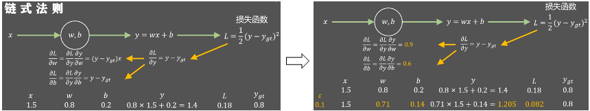

# 进阶题2：基于MLP的低轨卫星网络带宽预测性能优化挑战

&emsp;完成MLP网络设计，要求能够进行前向传播，反向传播和通过梯度下降方法训练，并实现准确的LEO卫星网络下行带宽预测，需使用DCU加速卡，并对训练和推理性能进行全面的评测：

输入：每次输入$t_0$, $t_0$, …, tN时刻的网络带宽值（N=10）；

输出：每次输出$t_{N+1}$时刻的网络带宽值；

MLP：输入层、隐藏层、输出层神经元数量和层数，以及训练参数、损失函数可自行设计优化；

数据集：一维的带宽记录，每个数据对应一个时刻的带宽值（已上传到测试环境中）；

## 基础知识和设计介绍
## 1.1 基于梯度下降的模型训练
&emsp; MLP网络中利用链式法则（Chain Rule）进行逐层反向传播，并计算各层权重与偏置的梯度，用于参数更新，主要逻辑如下图所示：

 

- [《动手学深度学习》书籍](https://zh-v2.d2l.ai/)中有详细的计算过程，此处不再赘述。

## 1.2 输入输出样本构建逻辑（滑动窗口）

&emsp; 将一维带宽序列（位于共享目录/public/SothisAI/learning_center/starlink_bw.json）转换为可用于MLP网络训练的数据，需读取带宽数据，并对数据进行归一化，构建训练集。
- 数据集示例：
  ```json
  [247.38, 254.71, 255.66, 243.14, 241.5, 240.55, 254.9, ...]
### 滑动窗口样本定义：

- 定义窗口大小 `N`（如 `N=10`），每个训练样本由连续 `N` 个值组成。
- 对应的预测目标是第 `N+1` 个时间点的带宽值。

### 输入维度与输出：

- 输入维度：`N`（窗口长度）
- 输出维度：`1`（单个预测值）

## 1.3 数据归一化设计

### 归一化目的：

- 减少不同样本间的尺度差异
- 加快梯度下降收敛速度

### 处理方式：

- 全局归一化：将所有样本按 `[0, 1]` 区间进行缩放：
- 反归一化：用于将预测结果还原为实际带宽值

## 1.4 数据批处理与训练集划分

### 批处理（Batching）：

- 将数据按固定 batch size（如：256）组织成小批量，可在DCU上进行高效计算。
- 每个batch为一个二维矩阵 `Batch × InputDim`。

### 数据集划分：

- 通常将原始样本按比例划分为训练集与测试集：
- 训练集：80%
- 测试集：20%

## 1.5 模型结构与训练目标

### 目标：

- 预测下一个时间点的带宽值（回归任务）

### MLP 结构：

- 输入层：`N` 个神经元
- 隐藏层多个：每层为全连接 + ReLU 激活
- 输出层：1个神经元，线性输出，也可以采用其他方式，如Softmax等


## 1.6 模型训练流程设计

### Step 1: 数据准备阶段

1. 读取 JSON 带宽序列
2. 数据归一化
3. 应用滑动窗口生成样本对 (X, Y)
4. 按批划分为训练/测试集

### Step 2: 模型前向传播

- 对输入样本执行矩阵乘法与非线性激活，层层输出最终预测值

### Step 3: 误差计算

- 使用回归损失函数，如均方误差 (MSE)


### Step 4: 反向传播

- 利用链式法则计算每层参数的梯度（1.1节）
- 支持基于全连接层的权重和偏置参数更新

### Step 5: 参数更新（梯度下降）

- 对每层的权重和偏置执行, 需要设置`lr`（learning rate）学习率

### Step 6: 重复Step 2-Step 5，直到达到预设的训练周期数

## 1.7 DCU设备加速执行策略

- 所有 Batch 数据拷贝至 DCU 端后执行完整一轮训练
- 每层矩阵乘法与 ReLU 激活用 HIP 核函数加速
- 前向传播与反向传播按 layer-by-layer 执行
- 每轮 Epoch 结束后更新参数并评估 Loss

## 1.8 性能评测指标建议

- 训练时间 / 推理延迟
- 每秒样本数（Throughput）
- 预测误差（MSE/MAE）
- 带宽预测趋势匹配度（可用曲线拟合图）

## 1.5 示例代码框架获取
查看和修改文件：
```
cp /public/SothisAI/learning_center/lesson3_sourcefile_mlp.cpp ./ //拷贝共享目录中的代码文件到当前目录
cp /public/SothisAI/learning_center/starlink_bw.json ./ //拷贝共享目录中数据文件到当前目录
ls //显示当前目录下的文件
vim lesson3_sourcefile_mlp.cpp //用vim打开代码文件并进行修改
```
注：也可以采用其他工具修改代码文件内容

## 关键设计总结

| 模块          | 说明                          |
|---------------|-------------------------------|
| 数据源        | 一维时间序列 JSON 带宽值       |
| 样本生成      | 滑动窗口，N 个输入预测下一个值 |
| 模型结构      | 多层感知机（全连接 + ReLU）    |
| 优化方法      | MSE损失 + 梯度下降            |
| 计算平台      | HIP + DCU 加速批量训练          |

## 参考资料

- [低轨卫星网络介绍](https://arxiv.org/abs/2405.06801) 

